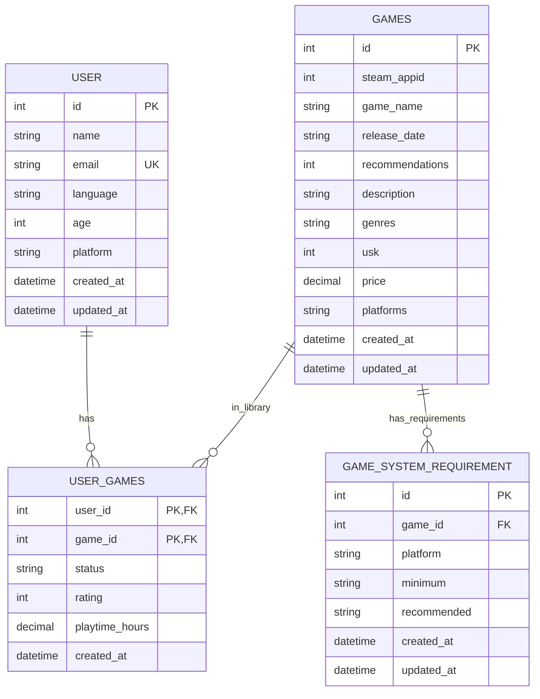

# Datenbankschema

## Zusätzliche Constraints

- `user.age >= 0`
- `games.usk IN (0, 6, 12, 16, 18)`
- `games.price >= 0`
- `games.recommendations >= 0`
- `user_games.status IN ('owned', 'wishlist', 'playing', 'completed')`
- `user_games.rating IS NULL OR (rating >= 0 AND rating <= 10)`
- `user_games.playtime_hours >= 0`
- `game_system_requirement.platform IN ('pc', 'mac', 'linux')`
- `UNIQUE(game_system_requirement.game_id, game_system_requirement.platform)`

## Hinweise zu Indizes

- `user.email` ist `UNIQUE` + indexiert.
- `games.game_name` ist indexiert.
- `games.steam_appid` ist indexiert.
- `game_system_requirement.game_id` ist indexiert.
